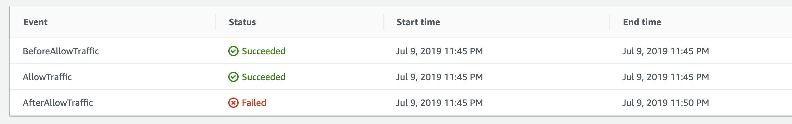

# sam-python

This is an example application which is made up of 2 lambda functions (written in Python) which will return a JSON response consisting of message string and the IP address the invocation request came from.

Each function sits behind an API Gateway which has been created in different ways to demonstrate the differences. They are both triggered by a GET to the `/whodis` endpoint or the `/oleoleole` endpoint.

## Installing SAM CLI

- First, ensure you have Docker installed on your machine.
- Then we need to install the SAM CLI. This is easy on a Mac if you have Brew :)

```bash
# Add aws tap
brew tap aws/tap

# Install the SAM CLI
brew install aws-sam-cli
```

## Testing locally

The functions retrieve the source IP by using the `requests` Python module, so to run it you will need to build it first. Building it will gather all dependencies in the [./sam_python/requirements.txt](whodis/requirements.txt) file and package them together with the application.

```bash
# Build the application, including any dependancies in requirements.txt
sam build

# Run the application locally
sam local start-api
```

`sam local start-api` starts up a mock API Gateway which listens on TCP 3000. When you call the defined endpoint (in this case `/whodis`), it will trigger the function to run by way of a container running locally.

Try the endpoint:

```bash
curl http://localhost:3000/whodis
curl http://localhost:3000/oleoleole
```

Expected response:

`{"message": "Whoop whoop! This is the sound of the Python", "location": "164.39.87.162"}`
`{"message": "Feelin' hot hot hot!", "location": "18.202.238.6"}`

## Deployment

Before deploying the application, it'll need to be archived to a .zip and uploaded to S3. This can be done using the `sam package` command:

```bash
sam package --output-template-file packaged.yaml --s3-bucket my-serverless-bucket 
``` 

The output template will essentially be a replica of the [./template.yaml](./template.yaml) file but with the S3 location of the package it's just uploaded. This is the CFN template that will be used in the next command which is used to provision the AWS resources:

```bash
sam deploy --template-file ./packaged.yaml --stack-name sam-python --capabilities CAPABILITY_IAM --region eu-west-1 --parameter-overrides AppVersion=v1
```

This will deploy the packaged.yaml template using CloudFormation.

### Gradual Deployments

SAM includes the means to "gradually" deploy a new function (using a canary or linear method). It does this by creating aliases to the new version of the function and gradually shifting traffic to the new function until you're satisfied that it's working. This can be determined by CW alarms and tests. If failures are detected then an automatic rollback can be initiated. More information about validating the deployments are in the "Automated Tests" section below.

When enabled via the SAM template, a CodeDeploy resource is automatically created for you, which can be viewed via the AWS Management Console.

You can deploy using a canary or linear method. The different methods are outlined below. In all cases, if an alarm or check fails with the newly deploy function, it's rolled back and traffic will fall back to the previously deployed function.

The `whodis` application uses a canary deployment in this example. You can test this by deploying the SAM stack, the incrementing the version in [app.py](./whodis/app.py) and re-building, packaging and deploying. Once it's deployed, keep hitting the /whodis endpoint and note the version changes for only 10% of the traffic until 5 minutes when all traffic is routed to the new version.

##### Canary

Example: `Canary10Percent30Minutes`

Traffic is switched in 2 increments. 10% of traffic when the new function is deployed, then the rest after 30 minutes.
    
##### Linear

Example: `Linear10PercentEvery2Minutes`

Traffic is shifted in equal increments so in the example above, this would be 10 percent of traffic every 2.

##### All at once

Example: `AllAtOnce`

All traffic is shifted to the new function immediately.

**Note:** More details on the types of gradual deployments available can be found [with AWS documentation](https://docs.aws.amazon.com/serverless-application-model/latest/developerguide/automating-updates-to-serverless-apps.html)

## Testing the deployment

### Manual Tests

Once the resources have been created, we should be able to test them using the outputs in the template file:

```bash
curl $(aws cloudformation describe-stacks --stack-name sam-python --query 'Stacks[].Outputs[?OutputKey == `WhoDisApi`].OutputValue[]' --output=text)
curl $(aws cloudformation describe-stacks --stack-name sam-python --query 'Stacks[].Outputs[?OutputKey == `OleoleoleApi`].OutputValue[]' --output=text)
```

We would expect to the following responses, respectively:

```
{"message": "Whoop whoop! This is the sound of the Python", "version": "v1", "location": "34.254.198.161"}
{"message": "Feelin' hot hot hot!", "version": "v1", "location": "54.171.101.139"}
```

### Automated Tests

When using a gradual deployment method, you can add "pre traffic" and "post traffic" hooks. These can be used to run an arbitrary Lambda function which will test that the new function is working as expected.

- Pre Traffic Hook: This is run before traffic is routed to the new function. An example might be an integration test which validates an expected response.
- Post Traffic Hook: This might be an end-to-end test. This function would be run when traffic is being routed to the new version of the function.   

In the background, AWS creates a CodeDeploy resource which performs the tests. In order for the testing function to pass or fail the deployment, it needs to have access to the CodeDeploy API. This is achieved in the policy which is added to the `OleoleolePreTrafficHookFunction` in the [template](./template.yaml)

### How the Automated Tests Work

The `OleOleOleFunction` is configured to deploy gradually with a `AllAtOnce` type, using a PreTraffic and PostTraffic hook to validate it is working as expected. The workflow of this is roughly:

1. SAM deploys the new version of the function.
2. A CodeDeploy resource is created for the new version and is responsible for running the Pre/Post tests.
3. When the new lambda function is deployed, the `PreTraffic` test is run. This points to another lambda defined in the same template called `OleoleolePreTrafficHookFunction`.
4. CodeDeploy runs the `OleoleolePreTrafficHookFunction`, which calls a simple unit test to confirm the expected response is received.
5. If the tests pass, the `OleoleolePreTrafficHookFunction` sends a success notification to the CodeDeploy API.
6. The deployment of the new version of the function continues (in this case, as an all at once type).
7. When the first increment of traffic has been shifted, the `PostTraffic` test is run by the `OleoleolePostTrafficHookFunction`.
8. CodeDeploy runs the `OleoleolePostTrafficHookFunction` test (which in this case is just a copy of the pre test hook).
9. If the tests pass, the `OleoleolePostTrafficHookFunction` sends a success notification to the CodeDeploy API. 
10. Deployment is complete.

If there was a failure with the tests, then the deployment would halt and and traffic shift would rollback to the old version of the function.

A failure can be simulated by swapping the commented lines in the [test_handler.py](./oleoleole/test_handler.py) file, in the `test_oleoleole_version_post_traffic` function so that the "Failed" status is sent to the Code Deploy API. Doing this will demonstrate the 3 event process that Code Deploy uses with gradual deployments. This is an example of what this looks like in the UI:



### Sending Code Deploy the Status Notification

The API information needed to send the status to the Code Deploy API is contained in the event message that is sent to the pre/post traffic lambdas. This is a simple dictionary with the Deployment ID and Event ID to use when specifying the status.

## Serverless Resources

There are multiple ways of creating an API Gateway resource, 2 of which are demonstrated in this repo, implicit creation and defined.

### Implicit

The `WhoDisFunction` defines the API gateway implicitly by adding it to the Events block. With no `RestApiId` property set, AWS knows it needs to create one. 

- The advantages of this is that it's simple to create and requires less code
- The disadvantage is that we have little control over the configuration of the gateway, eg, the StageName property will ALWAYS be "Prod".

### Defined

The `OleoleoleFunction` references a `RestApiId` resource in it's API Event block. This points to our `OleoleoleApi` resource. As this is a type of "AWS::Serverless::Api" we have the added options, such as `StageName`. 

- The advantages of this is that we have more control over how the API Gateway is defined. We can set the StageName to be "dev" for example or even provide our own definition file in yaml.
- The disadvantages of this is that less of the leg work in creating the API is done for us (although the effort required in the example here was pretty minimal).

